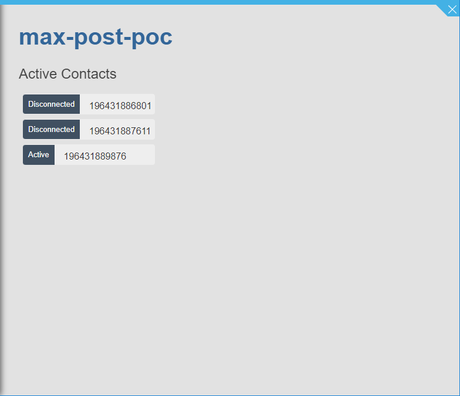
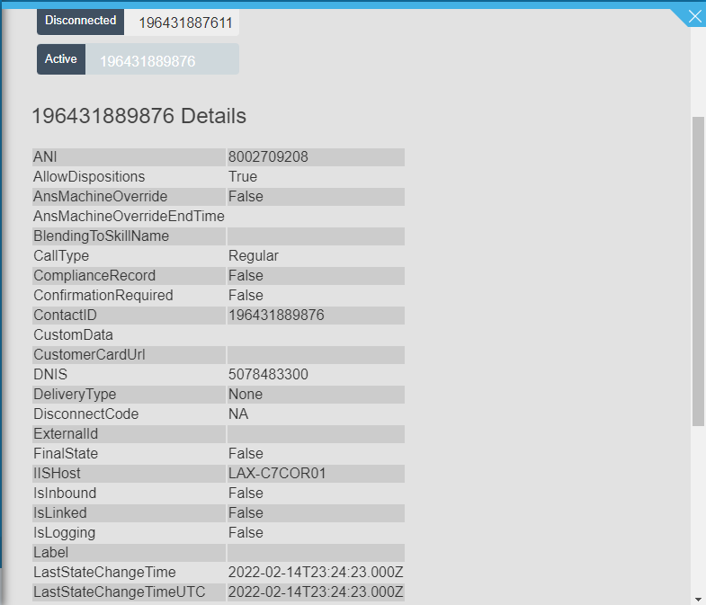

# MaxPostPoc

This project was generated with [Angular CLI](https://github.com/angular/angular-cli) version 11.0.1.

## Purpose
This proof-of-concept shows how you can build a webapp that will run embedded along with NICE CXone's MAX Agent Console. 

In it's current state, this app will update to you show you:
- Any active or previously handled contact in a session and it's status
- All ContactEvent details related to that contact

## Development server

Run `ng serve` for a dev server. Navigate to `http://localhost:4200/`. The app will automatically reload if you change any of the source files.
To test properly, you will need `http://127.0.0.1:4200` created as a Custom Workspace URL in your NICE CXone business unit. Then launch MAX to load your page.

## Code scaffolding

Run `ng generate component component-name` to generate a new component. You can also use `ng generate directive|pipe|service|class|guard|interface|enum|module`.

## Build

Run `ng build` to build the project. The build artifacts will be stored in the `dist/` directory. Use the `--prod` flag for a production build.

## Running unit tests

Run `ng test` to execute the unit tests via [Karma](https://karma-runner.github.io).

## Running end-to-end tests

Run `ng e2e` to execute the end-to-end tests via [Protractor](http://www.protractortest.org/).

## Further help

To get more help on the Angular CLI use `ng help` or go check out the [Angular CLI Overview and Command Reference](https://angular.io/cli) page.
